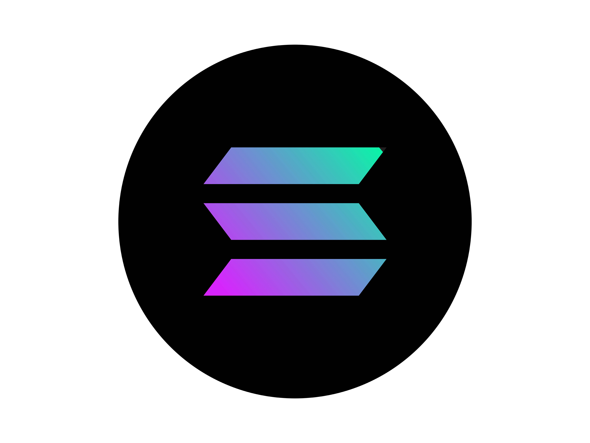

# Solana Price Prediction

[](https://www.python.org/)
[](https://fastapi.tiangolo.com/)
[](https://streamlit.io/)
[](https://scikit-learn.org/)
[](https://docs.pytest.org/)
[](https://docs.astral.sh/ruff/)



<sub>Image: [Solana cryptocurrency two.jpg](https://commons.wikimedia.org/wiki/File:Solana_cryptocurrency_two.jpg) by Clearus, licensed under [CC BY-SA 4.0](https://creativecommons.org/licenses/by-sa/4.0/).</sub>

Production-ready Python project for predicting Solana's next-day high price from OHLCV market data. The repository contains a reusable modeling package, a Streamlit dashboard, an optional FastAPI prediction service, and the original notebook retained as experiment history.

## What This Project Does

- Builds a cleaned Solana modeling dataset from Kraken, a downloadable URL, or local CSV exports.
- Generates technical indicators: SMA, RSI, volatility, and lagged price/volume features.
- Trains an anchored residual model with chronological train/validation/test splitting.
- Serves live predictions from a bundled joblib model or optional FastAPI endpoint.
- Displays Kraken market data and model predictions in Streamlit.

## Repository Layout

```text
solana-price-prediction/
|-- solana_price_prediction/     # Reusable Python package
|   |-- dataset.py               # Raw CSV loading and cleaning
|   |-- features.py              # Feature engineering shared by training and API
|   `-- modeling/
|       |-- train.py             # Model training CLI
|       `-- predict.py           # Batch inference CLI
|-- api/                         # Optional FastAPI service
|-- dashboard/                   # Streamlit dashboard
|-- notebooks/                   # Model training notebook
|-- models/                      # Trained model artifacts
|-- tests/                       # Unit tests
|-- pyproject.toml               # Package metadata and dependencies
`-- Makefile                     # Common developer commands
```

## Quick Start

Create an environment with Python 3.11, then install the project:

```bash
python -m venv .venv
.venv\Scripts\activate
python -m pip install -U pip
python -m pip install -r requirements.txt
```

Run the tests:

```bash
pytest
```

## Training Pipeline

Use Kraken's public OHLC API:

```bash
python -m solana_price_prediction.dataset --kraken-pair SOLUSD --kraken-interval 1440 --kraken-lookback-days 720
python -m solana_price_prediction.features
python -m solana_price_prediction.modeling.train
```

The Kraken request uses this endpoint:

```text
https://api.kraken.com/0/public/OHLC?pair=SOLUSD&interval=1440&since=<unix_timestamp>
```

Or use a downloadable CSV, JSON, or parquet URL:

```bash
python -m solana_price_prediction.dataset --input-url "https://example.com/solana.csv"
python -m solana_price_prediction.features
python -m solana_price_prediction.modeling.train
```

Or place raw Solana CSV files under `data/raw/Solana/`, then run:

```bash
python -m solana_price_prediction.dataset
python -m solana_price_prediction.features
python -m solana_price_prediction.modeling.train
```

Training uses chronological splits by default:

- 70% train
- 15% validation for early stopping
- 15% test for final reporting

Override the split ratios when needed:

```bash
python -m solana_price_prediction.modeling.train --validation-size 0.2 --test-size 0.2
```

Default outputs:

- Clean dataset: `data/processed/solana_model_data.parquet`
- Feature table: `data/processed/solana_features.parquet`
- Model artifact: `models/solana_next_day_high.joblib`
- Test predictions: `data/processed/solana_predictions.parquet`

The `data/` directory is intentionally ignored by Git.

## Run The Dashboard

```bash
streamlit run dashboard/app/main.py
```

The dashboard is self-contained by default:

- Live market data comes from Kraken.
- Predictions use the tracked model at `models/solana_next_day_high.joblib`.
- If `PREDICTION_API_URL` is configured in Streamlit secrets, the dashboard calls that API first and falls back to the bundled model if the API is unavailable.

## Streamlit Community Cloud

Use these settings when creating the Streamlit app:

- Repository: this GitHub repository
- Branch: `main`
- Main file path: `dashboard/app/main.py`
- Python version: `3.11`

No secrets are required for the bundled-model deployment. Optional secret:

```toml
PREDICTION_API_URL = "https://your-api.example.com"
```

## Optional API

```bash
cd api
python -m pip install -r requirements.txt
uvicorn app.main:app --reload --port 8000
```

Useful endpoints:

- `GET /health`
- `GET /predict/solana`
- `GET /docs`

## Notebook

The training notebook is available at `notebooks/solana_model_training.ipynb`. It fetches Kraken data, compares anchored residual model candidates, saves the selected joblib, and smoke-tests the saved model through the same inference path used by the dashboard.

The notebook logic is backed by importable modules:

- Data loading and cleaning: `solana_price_prediction.dataset`
- Target and feature creation: `solana_price_prediction.features`
- Model training and metrics: `solana_price_prediction.modeling.train`
- Inference: `solana_price_prediction.modeling.predict`

The notebook remains in `notebooks/` as an experiment record, while production code lives in the package and is covered by tests.
